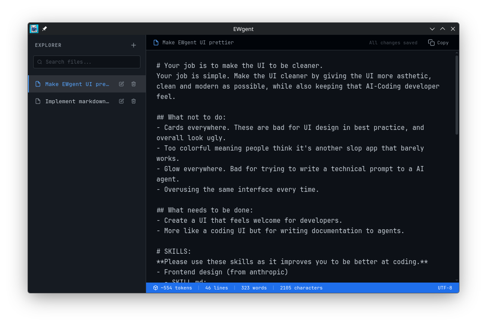

# EWgent (Epic Writing Agent)
EWgent is a tool to write a prompt before you send it to your preferred LLM.

## Why does it exist?
I have an issue.
- Sometimes, I would accidentally press my enter key and send it to the LLM.
- I write my prompts technical to let the LLM know what it should do to implement a feature. And writing on a VERY small text box would not cut it.
- Needed an excuse to make a app like this-

## How to use it?
Think of it like a notes app. Boom, you've just thought of EWgent. On a serious note, it is like a note app, but you write for your agent.

# Installation
As of right now, there's no pre-built binary. Although, I do plan to make a workflow soon. Here's how you can build it from source:
- Ensure you have both `pnpm` and `python` installed
  - To check, run `pnpm --version` and `python --version` in your terminal.
    - If it outputs the versions, you're good to go.
    - If you get errors, just install `python` and/or `pnpm` in their own website.
- Clone the repository by doing `git clone https://github.com/daveberrys/ewgent`, or just downloading the .zip in github.
- Run `python -m venv venv` to create a virtual environment.
  - Install required packages by doing `venv/bin/pip install -r requirements.txt` (or `venv\Scripts\pip install -r requirements.txt` in windows).
- Navigate to [`@src/frontend`](./src/frontend) by doing `cd src/frontend` (or `cd src\frontend` if you're in windows.) and run `pnpm install` to install the frontend dependencies.
- Navigate back two times by doing `cd ../..` (or `cd ..\..` in windows) and run `venv/bin/python run.py compile` (or `venv\Scripts\python run.py compile` in windows) to compile the app into a executable file.
  - Once done, open the `dist` folder and run the executable file.

## Why is the size when compiled so big?!
Because of pyqt, it will be massive. Why did I choose qt for the window? For some reason, my NVIDIA gpu wouldn't render GTK. So I forcefully had to go to QT so I can develop this damn app.
> [!NOTE]
> I just tried GTK when writing this. Dear god it's 350mb. We're keeping QT.

## This project uses: Pyder
Uses Python for the backend, Vite for the frontend. A link to Pyder is over here https://github.com/PinpointTools/Pyder

# License
[MIT](LICENSE)